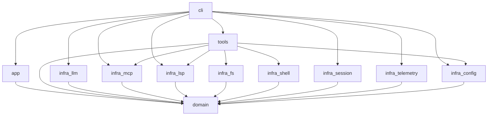

# Architecture

## Crate Map

| Crate | Layer | Purpose |
|-------|-------|---------|
| `crates/domain` | Domain | Entities, errors, port traits, mode policy, tool-name canonicalisation |
| `crates/app` | Application | Agent loop (`AgentLoop::execute`) |
| `crates/tools` | Infra | Native tools, `GuardedShell`, merging `ToolRegistry` |
| `crates/infra/llm` | Infra | OpenAI / Anthropic / OpenRouter / Ollama / vLLM clients |
| `crates/infra/mcp` | Infra | MCP stdio JSON-RPC client |
| `crates/infra/lsp` | Infra | LSP stdio JSON-RPC client |
| `crates/infra/filesystem` | Infra | Filesystem adapter (`std::fs`) |
| `crates/infra/shell` | Infra | Shell adapter (`std::process`) |
| `crates/infra/session` | Infra | UUIDv7 session store |
| `crates/infra/telemetry` | Infra | JSONL emitter + report writer |
| `crates/infra/config` | Infra | TOML + env configuration loader |
| `crates/cli` | Interface | `clap` CLI + ratatui TUI + composition root |

## Dependency Flow



## Ports & Adapters

The Domain layer defines **port traits** — `LlmPort`, `ToolRegistryPort`,
`Tool`, `McpPort`, `LspPort`, `SessionStorePort`, `TelemetryPort`, `Emitter`,
`FileSystemPort`, `ShellPort`, `PluginRegistryPort`, `LoggerPort` — plus the
owned message types that cross them (`LlmRequest`/`LlmEvent`, `ToolSpec`/
`ToolResult`, `Session`, `TelemetryEvent`, `UiEvent`). Infrastructure crates
provide the adapters; the CLI wires them into `App`.

This dependency inversion means:

- Domain contains no infra references and no third-party crates.
- Adapters are swappable — the engine's whole test suite runs on in-process
  fakes with no network, no filesystem, and no subprocesses.
- The engine cannot tell the TUI from the headless CLI: both drive
  `AgentLoop::execute` and differ only in the `Emitter` they install.

## Serde bridges

`domain` is serde-free by rule, so each adapter owns its own mirror types:
`infra/session` has `SessionFile` (with a `version` tag), `infra/telemetry`
converts `domain::ExtraField` into `serde_json::Value`, and `infra/lsp` maps
LSP wire JSON into domain-owned `LspLocation`/`LspWorkspaceEdit`. Adding a
field to a domain type means updating its mirror.

## Runtime shape

```
        ┌──────────────────────────────┐
        │            CLI (zcode)          │
        │  clap · ratatui · SIGINT     │
        │  wire(&Config) -> App        │
        └───────────┬──────────────────┘
                    │ Box<dyn Port + Send>
        ┌───────────▼──────────────────┐
        │             App              │
        │  AgentLoop::execute          │
        │  stream → tool → checkpoint  │
        └──┬────┬────┬────┬────┬───────┘
           │    │    │    │    │
         LLM  Tools Sess Telem Logger
           │    │
           │    ├── native (fs, guarded shell, skills)
           │    ├── mcp::McpClient (stdio JSON-RPC)
           │    └── lsp::LspClient (stdio JSON-RPC)
           │
        OpenAI / Anthropic / OpenRouter / Ollama / vLLM
```

There is **no async runtime**. The engine loop and the HTTP clients are
synchronous; the TUI runs the engine on one `std::thread` and streams
`UiEvent`s back over an `mpsc` channel while the main thread renders.

## Contributing

See `CONTRIBUTING.md`. Key rules:
- Domain depends on stdlib only (`make check-deps`).
- `#[forbid(unsafe_code)]` everywhere.
- Use `make ci` for full quality-gate verification.
