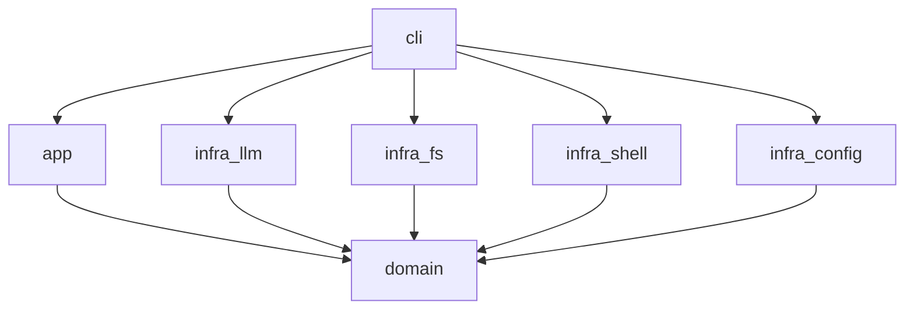

# Architecture

## Crate Map

| Crate                | Layer       | Purpose                                  |
|----------------------|-------------|------------------------------------------|
| `crates/domain`      | Domain      | Entities, errors, port traits            |
| `crates/app`         | Application | Use-case orchestration (`App`, `TaskRunner`) |
| `crates/infra/llm`   | Infra       | OpenAI-compatible LLM adapter            |
| `crates/infra/fs`    | Infra       | Filesystem adapter (`std::fs`)           |
| `crates/infra/shell` | Infra       | Shell adapter (`std::process`)           |
| `crates/infra/config`| Infra       | TOML + env configuration loader          |
| `crates/cli`         | Interface   | `clap` CLI + composition root            |

## Dependency Flow



## Ports & Adapters

The Domain layer defines **port traits** (`LlmPort`, `FileSystemPort`, `ShellPort`, `PluginRegistryPort`, `LoggerPort`). Infrastructure crates provide **adapter** implementations. The CLI (composition root) wires adapters into `App` via `Arc<dyn Port>`.

This dependency inversion means:
- Domain contains no infra references.
- Adapters can be swapped (e.g., mock in tests, real in production).
- Use-case traits (`TaskRunner`, `EditPlanner`) are declared in `app` and implemented by `App`.

## Future Composition Root

```
       ┌──────────────────────────┐
       │         CLI (ag)          │
       │  — clap parsing          │
       │  — wire() composition   │
       │  — tokio runtime         │
       └──────────┬───────────────┘
                  │ Arc<dyn Port>
       ┌──────────┴───────────────┐
       │         App              │
       │  — TaskRunner            │
       │  — EditPlanner           │
       └────┬────┬───┬───┬───┬────┘
            │    │   │   │   │
        ┌───▼──┐ │ ┌───▼───┐ │ ┌──────────┐
        │ LLM  │ │ │  FS   │ │ │  Shell   │
        └──┬───┘ │ └──┬────┘ │ └──┬───────┘
           │       │    │       │
      ┌──────┐  ┌────┐ │  ┌──────┐
      │OpenAI│  │std::│ │  │std::│
      │stub  │  │fs  │ │  │proc│
      └──────┘  └────┘ │  └──────┘
                      │
      ┌───────────────▼──────────────┐
      │        domain              │
      │  — Task, FileEdit, etc.    │
      │  — Port traits             │
      │  — DomainError             │
      └──────────────────────────────┘
```

## Contributing

See `CONTRIBUTING.md`. Key rules:
- Domain depends on stdlib only (`make check-deps`).
- `#[forbid(unsafe_code)]` is enforced in `cli`.
- Use `make ci` for full quality gate verification.
